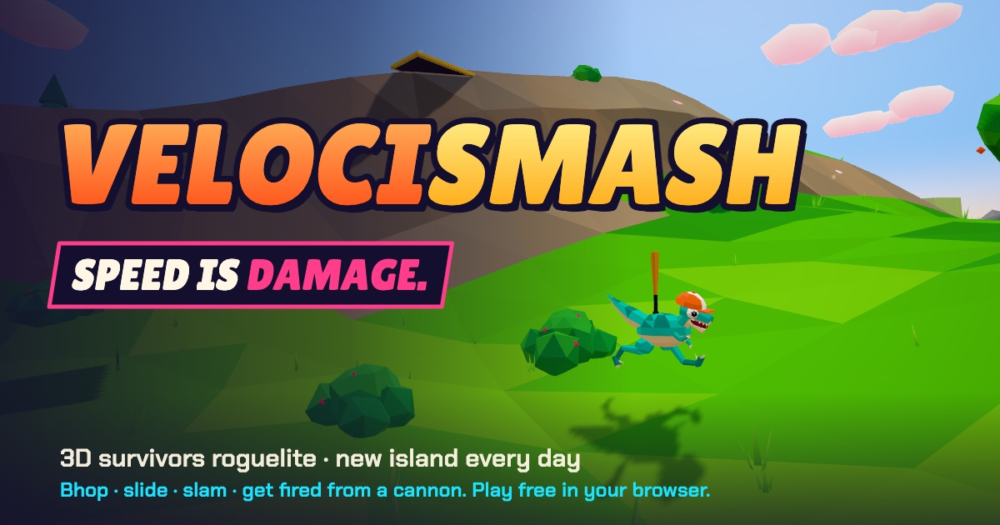

# VELOCIBONK



**[Play it in your browser →](https://alexmorrison12.github.io/velocibonk/)**

A 3D survivors roguelite where speed is damage. Bhop, slide and slam across an archipelago of five procedurally generated islands while your auto-weapons shred the horde. The faster you move, the harder everything hits: your momentum multiplies every hit and every point, and at ×2 you enter RAM mode and plow straight through them.

## The Archipelago

A run hops across up to five islands, each a different biome with its own terrain, enemies, music and final boss:

| # | Island | Biome | Final boss |
|---|---|---|---|
| 1 | Palm Paradise | tropical beaches and hills | Tiki Titan: sweeping eye lasers, coconut rain |
| 2 | Frostbite Peaks | slippery snow and frozen lakes | Yeti King: ice-spike lines, snowball barrages, frost breath |
| 3 | Sunscorch Dunes | dunes that double as launch ramps | Dune Devourer: burrows under you, sand tornadoes, scarab swarms |
| 4 | Gloomhollow | moonlit graveyard swamp | The Gravelord: teleport slashes, skull bullet-hell spirals |
| 5 | Magma Core | black basalt, lava rivers | Magmaw: fire breath, meteor rain, flyover bombing runs |

- Each island runs an **8:00 countdown**. Two mini-bosses show up along the way.
- The **boss portal** on your minimap summons the final boss early, for a score bonus.
- At **0:00** the boss arrives anyway and the **Final Swarm** of ghosts hunts you until it dies.
- Beat the boss and an **exit portal** opens. The first clear of an island unlocks the next one. From then on, runs chain islands, your build carries over, and weapon and tome level caps rise each island.

## Progression

- **26 quests** ("do X, unlock Y") unlock weapons, tomes, a shrine type, permanent perks, islands and characters.
- **Six raptors**, each with a starting weapon and a passive: Rex, Zappy, Nana, Blaze, Tank, and a secret one.
- **Shrines:**
  - **Blessing** gives you a tome.
  - **Moai Head** gives a raw stat boost that never caps.
  - **Challenge Totem** starts a timed kill trial with epic loot as the reward.
  - **Greed Idol** gives more gold and XP but makes enemies tougher.
  - **Magnet Pylon** pulls in every gem on the island.

## Features

- **Momentum combat.** Bunny-hopping, downhill slides, launches off hill crests, jump and boost pads, and ground-slams all raise a ×1–×8 damage and score multiplier.
- **Build crafting.** 12 auto-weapons, including Frost Nova and Black Hole. 14 stat tomes, rarity-rolled upgrade cards, chests and elite enemies.
- **Daily island chain.** Everyone gets the same seeded five-island chain each day.
- **Global leaderboard.** A daily top 10 and an all-time board on the title screen. Hit **BEAT IT** on any row to play that run's islands with its score as your target.
- **Challenge links** and **ghost racing** against your own best run.
- **Hordes.** 1,500+ enemies on screen, animated on the GPU with instanced meshes.
- **Fully procedural.** Every model, texture, sound effect and song is generated in code at load time. The whole game ships as a single ~1 MB HTML file.

## Controls

| Input | Action |
|---|---|
| WASD | Move |
| Mouse | Look (click to lock the cursor). Q/E or the arrow keys also turn |
| Space | Jump / double jump. Hold to auto-hop |
| Shift, C or right mouse | Slide on the ground. Slam when airborne |
| Esc or P | Pause |
| 1 / 2 / 3, R | Pick an upgrade card, reroll |

## Build

```bash
npm install
npm run build
```

`npm run build` writes `docs/index.html`, which GitHub Pages serves, plus a standalone `dist/index.html` you can open directly. `npm run dev` builds an unminified copy and serves it at http://localhost:5173.

## Code

three.js r186, bundled with esbuild. No other runtime dependencies.

| File | What it does |
|---|---|
| `src/main.js` | Game loop, run flow, island travel, boss intros, scoring, daily seeds, challenge links, ghosts |
| `src/stage.js` | One island: countdown, spawn director, mini-bosses, boss portal, Final Swarm, shrines and trials |
| `src/biomes.js` | The five islands: terrain shape, palettes, sky, liquids, props, ambience, bosses, level caps |
| `src/world.js` | Island generation: terrain, sea/ice/lava/swamp, sky with stars and aurora, props, landmarks |
| `src/bosses.js`, `src/hazards.js` | Boss brains and the attack kit (lasers, spike lines, tornadoes, bullet spirals, breath, meteors) |
| `src/progress.js` | Quests, unlocks, characters and perks (saved locally) |
| `src/player.js` | Momentum character controller and procedural animation |
| `src/enemies.js` | Horde simulation (typed arrays + spatial hash), instanced rendering, biome reskins |
| `src/weapons.js`, `src/upgrades.js`, `src/pickups.js` | Weapons, level-up cards, XP and gold |
| `src/models.js` | Procedural low-poly models |
| `src/audio.js` | Web Audio synthesized sound effects and biome soundtracks |
| `src/fx.js` | Particles, weather, damage numbers, portals, speed lines and post-processing |
| `src/ui.js`, `src/ui.css` | HUD and menus |
| `src/leaderboard.js` | Global leaderboard client (Supabase: scores are read and written only through two Postgres functions that validate and rate-limit submissions) |

Built with [Claude Code](https://claude.com/claude-code).
